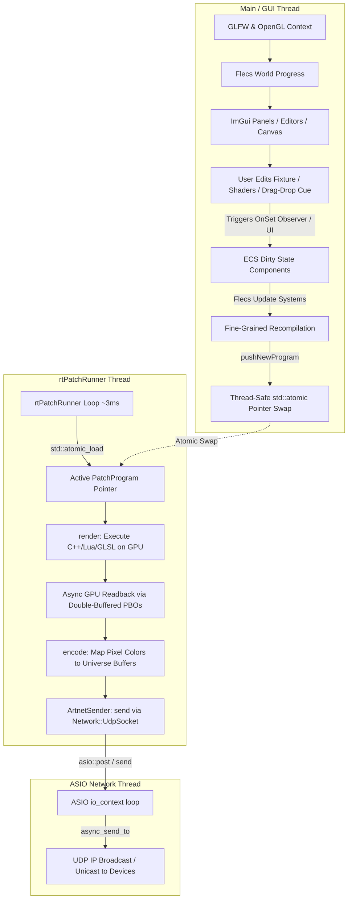

# PixelMapper Project Architecture & Developer Guide

Welcome to **PixelMapper** (internal working name: *Nique Madrix*). This document provides an overview of the project's goals, structural design, entity relationships, execution pipelines, and runtime execution thread models.

---

## 1. Project Goal

**PixelMapper** is a cross-platform, real-time DMX pixel mapping and pattern generation tool. It enables users to:
1. **Design Spatial Layouts (Patches):** Place and arrange multi-pixel lighting fixtures (e.g., lines, circles) on a 2D canvas.
2. **Assign DMX Patches:** Map pixels to specific DMX universes and start addresses.
3. **Generate Real-Time Visual Effects:** Animate pixel colors using C++ procedural functions, Lua scripts, or custom GLSL fragment shaders.
4. **Transmit DMX/ArtNet Data:** Stream raw channel data over UDP using the ArtNet protocol to multiple hardware controllers or visualizers.

---

## 2. Core Tech Stack

- **Language:** C++20
- **Build System:** CMake (configured with `CMakeLists.txt`)
- **Entity Component System (ECS):** [Flecs](https://github.com/SanderMertens/flecs) (used for managing scene graph state, layout observers, systems, and UI configuration)
- **GUI Frame & Context:** GLFW, OpenGL 3.x, and [Dear ImGui](https://github.com/ocornut/imgui) (configured with Docking and Viewports)
- **Asynchronous Networking:** [Asio](https://think-async.com/Asio/) (header-only network library handling low-latency UDP operations)
- **Scripting Integration:** Sol2 (for running Lua scripting contexts)
- **Text Editor:** [goossens/ImGuiColorTextEdit](https://github.com/goossens/ImGuiColorTextEdit) (embedded in the shader and script editors)
- **Math Library:** GLM (OpenGL Mathematics)
- **XML Library:** TinyXML2 (used for patch and UI state serialization)

---

## 3. Thread Architecture & Synchronization

To maintain high visual responsiveness without causing GUI micro-stutters, the application isolates user interaction from the high-frequency DMX rendering and networking engine. 

The main thread runs the UI loop and the ECS world update cycle, a detached real-time execution thread renders patterns, and an asynchronous network worker thread handles UDP packet transmission.



### 3.1 The Main/GUI Thread
- Runs the windowing loop, processes keyboard/mouse events, and renders the ImGui UI.
- Advances the Flecs ECS world using `world.progress()` on each frame.
- Re-compiles patterns, updates DMX patching maps, and handles layout recalculations.
- Coordinates OpenGL resource allocation (such as generating framebuffers and compiling shader pipelines).

### 3.2 The Real-Time Thread (`rtPatchRunner`)
- Spawns as a detached worker thread executing `App::runPatch()`.
- Runs continuously with a target cycle time of ~3ms (~330 Hz output capability) to ensure low latency.
- **Lock-Free Execution & Mutex Synchronization:** The primary `PatchProgram` swap is lock-free using `std::atomic<std::shared_ptr<PatchProgram>>`. However, thread synchronization for the Generative Visual Engine state updates, motive telemetry, and transition progress is coordinated via `generativeMutex`. The GUI thread holds the mutex during manual timeline changes (e.g. triggering next shader), and the RT thread locks it during runtime updates and when reading active indices and progress factors.

- Performs pattern rendering (`render`), async PBO readbacks, channel mapping (`encode`), and delegates sending to the network socket.

### 3.3 The ASIO Network Thread
- Spawns at initialization (`Network::init()`) running `asio::io_context::run()`.
- Processes asynchronous UDP socket output queue entries to prevent networking I/O latency from blocking the time-critical real-time rendering loop.

---

## 4. Entity Component System (ECS) Design

PixelMapper represents its data hierarchies and logical states through **Flecs** components, pair relationships, observers, and systems.

### 4.1 Hierarchy & Entities
- **`PixelMapperApp` (Root):** Holds the main system queries, reference configurations, and the `UIConfig` component.
  - **`Patches` (Folder):** Houses patch entities.
    - **`Patch` (Entity):** Houses a single configuration, and contains folders:
      - `FixtureFolder` -> holds `Fixture` entities.
      - `DmxOutputFolder` -> holds `Artnet::Universe` entities.
      - `ArtnetDeviceFolder` -> holds `Artnet::Device` entities.
      - `CueFolder` -> holds `CueList::Cue` entities.
      - `EffectFolder` -> holds `EffectBank::Effect` entities.
      - `PaletteFolder` -> holds `Generative::Palette::Is` entities.
      - `MotiveFolder` -> holds `Generative::Motive::Is` entities.

### 4.2 Key Components

| Component | Target Entity | Purpose |
| :--- | :--- | :--- |
| `Fixture::Layout` | Fixture | Defines number of pixels (`pixelCount`) and bytes per pixel (`channelsPerPixel`, e.g., 3 for RGB, 4 for RGBW). |
| `Fixture::DmxAddress` | Fixture | Defines start `universe` and start `address` (offset 0–511). |
| `Fixture::PixelData` | Fixture | Hosts dynamic runtime vectors of `positions` (glm::vec3) and `colors` (ColorRGBW). |
| `Shape::Line` / `Shape::Circle` | Fixture | Shape configurations containing dimensional properties (e.g., start/end, center/radius). |
| `Artnet::Universe::Properties` | Universe | Defines the DMX universe identifier (`universeId`). |
| `Artnet::Universe::Channels` | Universe | Raw `uint8_t buffer[512]` containing current universe bytes. |
| `Patch::RenderArea` | Patch | Bounding box coordinates representing the spatial span of all active pixels. |
| `Patch::GPUResources` | Patch | Holds persistent OpenGL handles for FBOs, textures, PBOs, and the blend program. |
| `Patch::GPUProgram` | Patch & Effect | Caches the compiled GLSL shader handle, source string, and compiler log. |
| `CueList::Cue::Is` | Cue | Tag component specifying that the entity is a sequencer Cue. |
| `CueList::Cue::HoldDuration` / `FadeDuration` | Cue | Float values storing sequencer time parameters for the cue. |
| `CueList::Cue::IndexOrder` | Cue | Integer index used to sort and reorder cues in the sequencer. |
| `EffectBank::Effect::Is` | Effect | Tag component specifying that the entity is a bank effect shader. |
| `EffectBank::Effect::GlslSource` | Effect | String storing the GLSL fragment shader code for the effect. |
| `Patch::Settings` | Patch | Stores patch configurations like refresh rate, network settings, white mode, highlight settings, and file paths. |
| `Patch::MultiSelection` | Patch | Holds a list of entity IDs representing the currently multi-selected fixtures in the patch. |
| `App::UIConfig` | App | Stores visible windows (including Generative Dashboard, Palettes, and Motives panels), layout choices, grid settings, viewport toggles, auto-zoom configurations, pixel size, active editor indexes, and editor generative preview override flags. |
| `Generative::Settings` | Patch | Stores timings, parameters, and manual index overrides for the Generative Visual Engine timelines. |
| `Generative::Palette::Is` | Palette | Tag component identifying a generative color palette. |
| `Generative::Palette::Stops` | Palette | Holds the vector of `ColorStop` structures defining gradient values. |
| `Generative::Palette::IsModeB` | Palette | Boolean configuring custom palette interpolation properties. |
| `Generative::Motive::Is` | Motive | Tag component identifying a generative motive preset. |
| `Generative::Motive::Params` | Motive | Component containing base parameters (velocity, complexity, scale, distortion, asymmetry, intensity) and noise wander configurations. |

### 4.3 Relationship Pairs & Exclusive Tags
Flecs relationship pairs specify routing, connections, and selection states:
- `(WithShape, Shape::Line)` or `(WithShape, Shape::Circle)` on fixtures.
- `(SelectedPatch, patch_entity)` on the App root (exclusive).
- `(SelectedFixture, fixture_entity)` on a Patch (exclusive).
- `(SelectedDmxUniverse, universe_entity)` on a Patch (exclusive).
- `(SelectedArtnetDevice, device_entity)` on a Patch (exclusive).
- `(InUniverse, universe_entity)` on a Fixture (can be multiple if a fixture spans universes).
- `(TargetEffect, effect_entity)` on a sequencer Cue (pairs the Cue with its active shader effect).

---

## 5. ECS Pipeline & Logical Systems

Observers and systems recalculate spatial layouts and patch maps in response to changes in the editor.

### 5.1 Observers & GPU Lifetimes
1. **`ObserveFixtureLayout` (OnSet layout):** Normalizes inputs and adds `LayoutDirty` to the fixture.
2. **`ObserveFixtureDmxAddress` (OnSet dmxAddress):** Clamps universe/address bounds and flags the parent patch as `DmxMapDirty`.
3. **`CleanGPUResources` / `CleanGPUProgram` (OnRemove observers):** Registered in `Patch.cpp`, these observers automatically delete OpenGL framebuffers, textures, and linked programs on the main GUI thread (possessing the OpenGL context) when a patch or effect entity is destructed, preventing resource leaks.

### 5.2 Dynamic Selection Tracking
- **`UpdateRtSelectionFlags` System:** Runs during the `PreStore` phase on each frame. It reads the active `SelectedFixture` and the `MultiSelection` components on the patch. It maps these IDs against the `CompiledFixture` array in the active `PatchProgram` and updates the `pixelSelected` atomic array. This relays selection changes to the real-time runner thread on-the-fly, avoiding costly program recompilations.

### 5.3 Systems & Compilation Sequence

```
[Layout Changed] -> UpdateFixtureLayout System
                    • Resizes pixel position & color vectors
                    • Adds PixelPositionsDirty to Fixture
                    • Adds DmxMapDirty to Patch
                          |
                          v
[Shape Dragged]  -> UpdateLinePixelPositions / UpdateCirclePixelPositions
                    • Computes local coordinates based on Line/Circle specs
                    • Removes PixelPositionsDirty
                    • Adds RenderAreaDirty to Patch
                          |
                          v
                    UpdateRenderArea
                    • Computes absolute min/max bounding box of all pixels
                    • Adds ProgramDirty to Patch
                          |
                          v
[DMX Re-patched] -> UpdateDmxOutputMap
                    • Determines needed universes
                    • Allocates/deletes Universe entities
                    • Updates InUniverse relationship edges
                    • Adds ProgramDirty to Patch
                          |
                          v
[Program Dirty]  -> PatchProgramCompile
                    • Executes fine-grained OpenGL updates
                    • Flattens active patch layout and cue entities into static arrays
                    • Pushes flat PatchProgram pointer to rtPatchRunner via atomic swap
```

### 5.4 Fine-Grained OpenGL Compilation
To keep compilation times low (typically under 2ms for topology changes), `PatchProgram::compile` uses a fine-grained strategy:
1. **FBO Recycling:** Resizes the framebuffers (`GPUResources` component) only if the Virtual Framebuffer (VFB) resolution changes.
2. **Shader Link Recycling:** Checks if the GLSL source code stored in `GPUProgram` has actually changed before recompiling and relinking. If the code matches, it recycles the compiled OpenGL shader program.
3. **Cue List Sorting:** Cues are queried and compiled ahead-of-time, sorted by `IndexOrder`.

---

## 6. Real-Time Execution Structure (`PatchProgram`)

The compilation phase creates a flat, cache-friendly representation `PatchProgram` for the execution thread:

- **`pixelPositions` (Array of vec3):** Flat list of positions for visual algorithms.
- **`pixelColors` (Array of ColorRGBW):** Shared array where rendering outputs write.
- **`universes` (Array of Universe structs):** Contains final 512-byte buffers.
- **`p2us` (Array of Pix2UniCopyInstr):** Pre-compiled instructions mapping contiguous byte ranges from the pixel colors array directly to destination universe buffers.
- **`fixtures` (Array of CompiledFixture):** Pre-compiled fixture information containing `entityId`, `pixelStart`, and `pixelCount`.
- **`pixelSelected` (Array of std::atomic<bool>):** Indicators signaling which pixels are currently selected in the GUI.
- **`whiteMode` (WhiteMode enum):** Dictates how raw RGB colors are mapped to RGBW outputs (Auto, Off, or Pass-through).
- **`highlightFrequency` (float):** Flash frequency for identifying selected fixtures.
- **`generativeSettings` (`Generative::Settings`):** Real-time settings for timing, sub-timeline enabled options, and manual override state.
- **`palettePool` (Array of `CompiledPalette`):** Pre-compiled gradients flattened for high-performance timeline selection.
- **`motivePool` (Array of `CompiledMotive`):** Pre-compiled set of physics-based generative parameters and wander noise amplitudes.
- **`generativeRuntime` (`std::shared_ptr<GenerativeEngineRuntime>`):** Scheduler and state machine processing palette, motive, and shader queue updates.
- **`glslUboId` (unsigned int):** OpenGL Uniform Buffer Object buffer handle allocated to host the `EngineState` block.
- **`editorPreviewOverrideActive` (bool):** Active override flag toggled by the shader editor sandbox preview.
- **`editorPreviewOverrideUbo` (`Generative::EngineStateUBO`):** Standard UBO mirror state holding overridden palette stop selections and motive slider values.
- **`generativeMutex` (`std::mutex`):** Coordinates safe, race-free read/write access to the engine runtime from the GUI thread and real-time execution thread.

### 6.1 GPU Point-Rendering & Previews
When the active render mode is GLSL, the real-time thread executes the following operations:
1. **1D GPU Point-Rendering:** Binds the active 1D FBO (`glslFbo`) and configures the viewport to `(pixelCount, 1)`. It renders the pixels as a point list using `glDrawArrays(GL_POINTS, 0, pixelCount)`. The vertex shader assigns raw 3D positions (`vPixelPos3D`) and CPU-projected 2D coordinates (`vPixelPos2D`) to variables, mapping each point to exactly 1 fragment in the 1D viewport.
2. **Double-Buffered PBO Readback:** Employs double-buffered Pixel Buffer Objects (PBOs) to copy the rendered 1D pixel buffer back to the CPU array (`vfbPixels`) asynchronously. Since the buffer size is extremely small (e.g. `pixelCount * sizeof(ColorRGBW)`), readback overhead is negligible.
3. **2D Offline Preview FBO:** Renders a 2D quad of size `previewWidth x previewHeight` to the editor preview FBO (`glslEditorFbo`) using `glslPreviewProgram` and the current `zSlice` uniform value. This is displayed in the **Effect Preview** window, and its dimensions are configured via the "Preview Resolution" slider, matching the aspect ratio of the RenderArea.
4. **2D Playback Preview FBO:** Renders the active playback program into the `previewWidth x previewHeight` 2D playback preview FBO (`glslPlaybackPreviewFbo`) to display the live pattern as the canvas background. To optimize GPU performance, it is only rendered when the "Rendered" checkbox is enabled, the canvas is in 2D mode, and the Patch Editor window is open. The final rendered result is copied on the GPU to a double-buffered display texture to prevent concurrent GUI thread read races.

5. **Uniform Buffer Object binding (UBO):** A GPU-backed dynamic Uniform Buffer (`glslUboId`) containing the serialized `EngineStateUBO` structure is bound to uniform binding point `0` using `glBindBufferBase(GL_UNIFORM_BUFFER, 0, glslUboId)`. During compilation, the shader compiler automatically injects the corresponding `EngineState` block declaration and helper color lookup routines (`samplePalette(pos)` and `samplePaletteWrapped(pos)`) into all custom fragment shaders. When the editor override is active, custom UBO contents are briefly uploaded to bind to the offline preview FBO pass thread-safely before being swapped back to standard runtime parameters.

### 6.2 Post-Rendering Filters
After generating pixel colors via GPU or CPU (Lua/C++), the real-time thread runs post-processing steps:
1. **Selection Flashing (Find):** Pixels with their atomic select flags set to `true` are flashed white (RGBW: `255, 255, 255, 255`) at the speed defined by `highlightFrequency`.
2. **RGB to RGBW White Extraction:** Matches the `whiteMode` settings:
   - **`AUTO`:** Extracts white from the RGB channels: $W = \min(R,G,B)$, then subtracts $W$ from the RGB channels and assigns it to $W$.
   - **`OFF`:** Enforces $W = 0$ for all pixel outputs.
   - **`PASSTHROUGH`:** Bypasses conversion, using the raw $W$ channel outputted by shaders or canvas renderers.

### 6.3 CPU-Side Crossfading
During cue transitions in non-GLSL modes (Lua, C++), the real-time thread performs CPU-side crossfading:
- Prior to the transition, it captures the current state by copying `vfbPixels` into `vfbPixelsOld` using a fast `std::memcpy`.
- It interpolates the pixels using the transition's blend factors in memory before encoding them.

### 6.4 GPU-Side Crossfading
During sequence transitions, the real-time thread performs GPU-side crossfading for both primary outputs and 2D playback previews:
- **Primary 1D Outputs**: The outgoing and active cues are rendered to separate 1D textures (`glslFboTexOld` and `glslFboTex`), blended via `glslBlendProgram` into `glslFboTexBlend` using the active cue's transition `mixFactor`, and read back via PBOs.
- **2D Playback Previews & Double-Buffered Presentation**: The outgoing and active 2D previews are rendered to separate `previewWidth x previewHeight` textures (`glslPlaybackPreviewFboTexOld` and `glslPlaybackPreviewFboTex`), blended via `glslBlendProgram` into `glslPlaybackPreviewFboTexBlend` using the transition progress, and bound as the background image in the GUI. To prevent thread concurrency race conditions and 1-frame rendering stutters in the GUI, a double-buffered presentation mechanism is used:
  - The final rendered FBO (either the blend FBO or the active preview FBO) is blitted on the GPU using `glBlitFramebuffer` to a presentation display backbuffer texture (`glslPlaybackPreviewDisplayTex[writeIdx]`).
  - The RT thread atomically swaps the read/write presentation indices and exposes the fully completed, static texture to `glslCurrentPlaybackPreviewTexID`.
  - The GUI thread displays the texture ID stored in `glslCurrentPlaybackPreviewTexID`, ensuring it never reads a texture while the GPU is actively rendering to it.


### 6.5 Encoding
Copies pixel color channels to universe buffers using pre-compiled instructions:
```cpp
void encode(PatchProgram* program) {
    for (int i = 0; i < program->p2uCount; i++) {
        const PatchProgram::Pix2UniCopyInstr& map = program->p2us[i];
        uint8_t* dest = program->universes[map.universeIndex].buffer + map.universeOffset;
        ...
        std::memcpy(dest + bytesWritten, src + pByte, toCopy);
    }
}
```

---

## 7. Art-Net UDP Sender Implementation

Streaming DMX universes to external fixtures is handled by the **`ArtnetSender`** subsystem:

1. **Protocol Header Format:**
   `ArtnetSender` formats outgoing universe buffers into `ArtDmx` UDP packets conforming to the Art-Net protocol:
   - Header: `"Art-Net\0"` (8 bytes)
   - OpCode: `0x5000` (Little Endian, 2 bytes)
   - ProtVer: `14` (Big Endian, 2 bytes)
   - Sequence: `0x00` (disabled) or incrementing (1 byte)
   - Physical: `0x00` (1 byte)
   - Universe: Target universe ID (14-bit value, Big Endian, 2 bytes)
   - Length: Payload length (512 bytes, Big Endian, 2 bytes)
   - Data: Raw channel data (512 bytes)

2. **Socket Management & Asio Integration:**
   Instead of direct blocking POSIX sockets, `ArtnetSender` delegates operations to a `Network::UdpSocket` instance running on top of **Asio**. Sockets are opened and bound asynchronously inside Asio's I/O thread. Broadcast options (`SO_BROADCAST`) and address reuse (`SO_REUSEPORT` / `SO_REUSEADDR`) are managed natively by the Asio layer to prevent binding issues, especially on macOS.

3. **Multi-Device IP Routing:**
   Iterates over all devices registered under the `ArtnetDeviceFolder`. Matches the active universes to each device's start universe and universe count, then routes packets to the target device's IP address (translated from network byte order to host byte order for the Asio wrapper).

4. **Thread-Safe Status Reporting:**
   Asynchronous socket error callbacks update the network status string. This string is stored thread-safely in `App::rtNetworkStatus` under `App::rtNetworkStatusMutex`, enabling the GUI main thread to render connection health updates in the Settings window.

---

## 8. Modular Rendering: Lua Scripting & 1D Canvas

To support runtime programmability without recompiling the application, PixelMapper implements a modular Lua scripting engine.

### 8.1 Architectural Paradigm
To accommodate non-grid spatial configurations while preserving high performance, PixelMapper uses a **1D Canvas & Point-Mapping** architecture:

1. **1D Framebuffer**: The C++ and Lua rendering pipelines execute directly against a 1D virtual framebuffer (`vfbPixels`) of dimensions `(pixelCount, 1)`. The $i$-th pixel in the canvas corresponds directly to the physical fixture pixel index.
2. **Lua Drawing Context**: The Lua script interacts with a C++ class bound via `Sol2` (representing a `Canvas` API), drawing procedurally or reading pixel parameters.
3. **Direct Mapping**: During the render phase, CPU-side bilinear spatial sampling has been replaced by a direct memory copy (`std::memcpy`) of the 1D virtual framebuffer to the final `pixelColors` array, eliminating PCI-e bandwidth bottlenecks and sampling stutters.

### 8.2 Execution & Thread Safety
- **Isolate VMs:** To prevent concurrency race conditions, each `PatchProgram` owns a dedicated, self-contained `sol::state` (Lua VM).
- **Compile on GUI Thread:** Script loading and compilation happen on the Main/GUI thread.
- **Hybrid Script Storage:** The patch settings store a reference path to an external `.lua` script file. The source code is loaded into memory for inline editing, allowing simple file persistence, version control, and serialization.
- **Run on Real-Time Thread:** Once compiled successfully, the new program is pushed to `rtPatchRunner`. The real-time thread executes the Lua function `update(canvas, time)` once per frame, updates the grid, samples the colors to physical pixels, and encodes the DMX payload.

### 8.3 Text Editor & Compilation Feedback UI
A built-in script editor is embedded using the modern [goossens/ImGuiColorTextEdit](https://github.com/goossens/ImGuiColorTextEdit) fork, providing:
- Lua syntax highlighting, line numbers, and indentation.
- **Compilation Error Handling:** If compilation fails (e.g. syntax or runtime compile error), the script's compiler log is parsed:
  - Error markers are placed on the exact source line in the ImGui editor workspace.
  - A persistent "Log Console" window is shown at the bottom of the editor displaying full stack traces and debug output.
- Code folding and search/replace functionality.

---

## 9. Generative Visual Engine & Show Control

PixelMapper integrates a non-linear, fluid Generative Visual Engine running on the real-time execution thread. The engine orchestrates three decoupled queues: Palettes, Motives, and Shaders.

### 9.1 The Three Timelines (Queues)
1. **Palette Queue:** Manages the continuous morphing of color gradients.
2. **Motive Queue:** Animates the structural physics parameters (Velocity, Complexity, Scale, Distortion, Asymmetry, and Intensity) of the scene using Perlin Noise wandering LFOs.
3. **Shader Queue:** Transitions through active GLSL programs using linear, luma wipe, or sweep transitions. The Shader Queue pulls compiled shader programs directly from the Cue List (`compiledCues`), allowing the cue list to act as the master "bag" of shaders for the show loop.

### 9.2 Zero-Width Spawning & Spatial Morphing
To execute smooth, continuous transitions between color palettes of varying stop counts without visual "mud" or final snapping jumps, the engine implements a zero-width duplicate stop padding algorithm:
- **Phase 1: Initialization**
  - Identifies the maximum stop count: `M = max(PaletteA.numStops, PaletteB.numStops)` (capped at 16).
  - Enforces the **Pre-Flight Looping Constraint**: If a palette starts and ends with similar colors (indicating it is designed to wrap), the engine guarantees `stops[0].position == 0.0`, `stops[numStops-1].position == 1.0`, and `stops[0].color == stops[numStops-1].color`.
  - Pads the smaller palette to size `M` by cloning existing stops using the index mapping formula:
    $$source\_index = \text{round}\left(\frac{i}{M - 1} \times (N - 1)\right)$$
    This creates zero-distance boundaries that are visually identical to the original palette.
  - Immediately sets the UBO `activeStops` count to `M`.
- **Phase 2: Per-Frame Update**
  - Wraps the transition's linear progress in a `smoothstep(0.0f, 1.0f, progress)` easing function.
  - Linearly interpolates the positions, smoothness, and colors of the padded stops, and uploads them to the GPU.
- **Phase 3: Finalization**
  - Resets the transition variables.
  - Restores `activeStops` back down to the target palette size (`PaletteB.numStops`) to cull overlapping zero-width duplicate stops and save GPU cycles.

### 9.3 Show Control & Cue List Transitions
- **Priority:** When a Cue is triggered manually or automatically from the Cue List sequencer (`activeCueIndex >= 0`), the Cue's GLSL shader takes absolute rendering priority. The generative shader queue transitions are suspended, while the generative Palette and Motive queues remain active and uploaded to the UBO, allowing cue shaders to use the animated palettes and noise telemetry.
- **Stop Transport Control:** A "Stop" button in the Cue List transport bar resets the active cue index to `-1`, which cleanly terminates sequence playback and allows the generative shader queue to immediately resume automatic show cycling.

### 9.4 Editor Generative Preview Overrides
To facilitate offline shader programming, the **Effect Editor** features an "Override Generative Data for Preview" panel at the top:
- When checked, it isolates the **Effect Preview** window from the live generative show loop.
- It displays a custom palette selector combo box and six motive sliders (Velocity, Complexity, Scale, Distortion, Asymmetry, Intensity).
- During the offline render pass, the rendering pipeline overrides the standard UBO contents with these custom sliders and uploads them to the GPU, restoring the live UBO state immediately afterwards to keep the output running on fixtures uninterrupted.

### 9.5 Real-Time Diagnostic Visualizers
- **Dashboard Stops Preview:** Displays circles filled with each stop's real-time color and draws thin vertical alignment lines up to the gradient bar to visually track spatial sliding and morphing.
- **Generative Visualizer Preset:** A diagnostic GLSL shader preset that warps a plasma wave based on the live motive variables and overlays 6 horizontal color-coded gauges representing parameter values.

