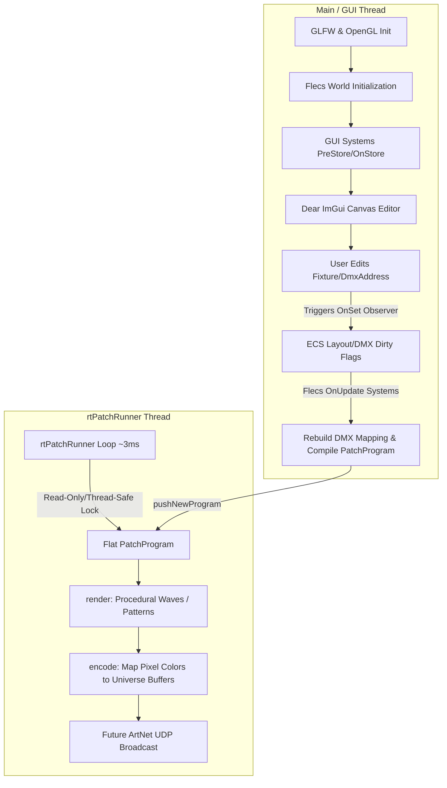

# PixelMapper Project Architecture & Developer Guide

Welcome to **PixelMapper** (internal working name: *Nique Madrix*). This document provides an overview of the project's goals, structural design, entity relationships, execution pipelines, and a roadmap for starting development.

---

## 1. Project Goal

**PixelMapper** is a cross-platform, real-time DMX pixel mapping and pattern generation tool. It enables users to:
1. **Design Spatial Layouts (Patches):** Place and arrange multi-pixel lighting fixtures (e.g., lines, circles) on a 2D canvas.
2. **Assign DMX Patches:** Map pixels to specific DMX universes and start addresses.
3. **Generate Real-Time Visual Effects:** Animate pixel colors using procedural algorithms or shaders.
4. **Transmit DMX/ArtNet Data:** Stream raw channel data over a network using the ArtNet protocol to hardware controllers or visualizers.

---

## 2. Core Tech Stack

- **Language:** C++20
- **Build System:** CMake (configured with `CMakeLists.txt`)
- **Entity Component System (ECS):** [Flecs](https://github.com/SanderMertens/flecs) (used for managing scene graph state, layout observers, and systems)
- **GUI Frame & Context:** GLFW, OpenGL 3.x, and [Dear ImGui](https://github.com/ocornut/imgui) (configured with Docking and Viewports)
- **Math Library:** GLM (OpenGL Mathematics)
- **XML Library:** TinyXML2 (linked for saving and loading patches)

---

## 3. Architecture Overview

The application is split into two primary threads of execution to keep UI rendering and high-frequency DMX processing isolated:



### 3.1 The Main/GUI Thread
- Runs the windowing loop, processes keyboard/mouse events, and renders the ImGui UI.
- Advances the Flecs ECS world using `world.progress()` on each frame.
- Direct interaction with fixture coordinates and parameters occurs here.

### 3.2 The Real-Time Thread (`rtPatchRunner`)
- Spawns as a detached worker thread executing `App::runPatch()`.
- Runs continuously with a target cycle time of ~3ms (~330 Hz output capability, well exceeding the typical 40-44 Hz DMX rate).
- **Zero Flecs overhead:** The thread locks a mutex, retrieves a flat, compiled structure called `PatchProgram`, and executes `render()` (effects generation) followed by `encode()` (mapping pixel colors to contiguous DMX buffers).

---

## 4. Entity Component System (ECS) Design

PixelMapper represents its data hierarchies and logical stages through **Flecs** components, pair relationships, observers, and systems.

### 4.1 Hierarchy & Entities
- **`PixelMapperApp` (Root):** Holds global queries and reference configs.
  - **`Patches` (Folder):** Houses patch entities.
    - **`Patch` (Entity):** Houses a single configuration, and contains folders:
      - `FixtureFolder` -> holds `Fixture` entities.
      - `DmxOutputFolder` -> holds `Artnet::Universe` entities.
      - `ArtnetDeviceFolder` -> holds `Artnet::Device` entities.

### 4.2 Key Components

| Component | Target Entity | Purpose |
| :--- | :--- | :--- |
| `Fixture::Layout` | Fixture | Defines number of pixels (`pixelCount`) and bytes per pixel (`channelsPerPixel`, e.g., 3 for RGB, 4 for RGBW). |
| `Fixture::DmxAddress` | Fixture | Defines start `universe` and start `address` (offset 0–511). |
| `Fixture::PixelData` | Fixture | Hosts dynamic runtime vectors of `positions` (glm::vec3) and `colors` (ColorRGBW). |
| `Shape::Line` / `Shape::Circle` | Fixture | Shape configurations containing dimensional properties (e.g., start/end, center/radius). |
| `Artnet::Universe::Properties` | Universe | Defines the DMX universe identifier (`universeId`). |
| `Artnet::Universe::Channels` | Universe | Raw `uint8_t buffer[512]` containing current universe bytes. |
| `Patch::RenderArea` | Patch | Bounding box coordinates representing the spatial span of all active pixels. |

### 4.3 Relationship Pairs & Exclusive Tags
Flecs relationship pairs specify routing and UI selection:
- `(WithShape, Shape::Line)` or `(WithShape, Shape::Circle)` on fixtures.
- `(SelectedPatch, patch_entity)` on the App root (exclusive).
- `(SelectedFixture, fixture_entity)` on a Patch (exclusive).
- `(SelectedDmxUniverse, universe_entity)` on a Patch (exclusive).
- `(InUniverse, universe_entity)` on a Fixture (can be multiple if a fixture spans universes).

---

## 5. ECS Pipeline & Logical Systems

When changes occur in the editor, observers and systems automatically recalculate the spatial and patch mappings.

### 5.1 Observers
1. **`ObserveFixtureLayout` (OnSet layout):** Normalizes inputs and adds `LayoutDirty` to the fixture.
2. **`ObserveFixtureDmxAddress` (OnSet dmxAddress):** Clamps universe/address bounds and flags the parent patch as `DmxMapDirty`.

### 5.2 Systems & Compilation Sequence

```
[Layout Changed] -> UpdateFixtureLayout System
                    • Resizes pixel position & color vectors
                    • Adds PixelPositionsDirty to Fixture
                    • Adds DmxMapDirty to Patch
                          |
                          v
[Shape Dragged]  -> UpdateLinePixelPositions / UpdateCirclePixelPositions
                    • Computes local coordinates based on Line/Circle specs
                    • Removes PixelPositionsDirty
                    • Adds RenderAreaDirty to Patch
                          |
                          v
                    UpdateRenderArea
                    • Computes absolute min/max bounding box of all pixels
                    • Adds ProgramDirty to Patch
                          |
                          v
[DMX Re-patched] -> UpdateDmxOutputMap
                    • Determines needed universes
                    • Allocates/deletes Universe entities
                    • Updates InUniverse relationship edges
                    • Adds ProgramDirty to Patch
                          |
                          v
[Program Dirty]  -> PatchProgramCompile
                    • Flattens active patch layout into static arrays
                    • Pushes flat PatchProgram pointer to rtPatchRunner
```

---

## 6. Real-Time Execution Structure (`PatchProgram`)

The compilation phase creates a cache-friendly representation `PatchProgram` for the execution thread:

- **`pixelPositions` (Array of vec3):** Flat list of positions for visual algorithms.
- **`pixelColors` (Array of ColorRGBW):** Shared array where rendering outputs write.
- **`universes` (Array of Universe structs):** Contains final 512-byte buffers.
- **`p2us` (Array of Pix2UniCopyInstr):** Pre-compiled instructions mapping contiguous byte ranges from the pixel colors array directly to destination universe buffers.

### 6.1 Rendering (`render`)
Currently executes a placeholder sin-wave pattern based on the spatial distance to the patch center.

### 6.2 Encoding (`encode`)
Sequentially copies pixel color channels to universe buffers using the pre-compiled instructions:
```cpp
void encode(PatchProgram* program) {
    for (int i = 0; i < program->p2uCount; i++) {
        const PatchProgram::Pix2UniCopyInstr& map = program->p2us[i];
        uint8_t* dest = program->universes[map.universeIndex].buffer + map.universeOffset;
        ...
        std::memcpy(dest + bytesWritten, src + pByte, toCopy);
    }
}
```

---

## 7. Jumpstarting Development: Implementing the ArtNet UDP Sender

To make the PixelMapper operational with external fixtures, the next critical step is building the **ArtNet UDP socket sending thread**.

### How to approach this:
1. **Network Protocol Format:**
   ArtNet packets are sent via UDP to port **6454**. The ArtNet packet structure (specifically `ArtDmx`) contains:
   - Header: `"Art-Net\0"` (8 bytes)
   - OpCode: `0x5000` (Little Endian, 2 bytes)
   - ProtVer: `14` (Big Endian, 2 bytes)
   - Sequence: `0x00` (disabled) or incrementing (1 byte)
   - Physical: `0x00` (1 byte)
   - SubUni/Universe: (14-bit value, 2 bytes)
   - Length: (512-byte buffer length, Big Endian, 2 bytes)
   - Data: DMX payload (512 bytes)

2. **C++ Socket Implementation on macOS:**
   - Create a UDP socket using standard POSIX sockets (`sys/socket.h`, `netinet/in.h`, `arpa/inet.h`).
   - Configure the socket for broadcasting (`SO_BROADCAST`) or unicast to specific controller IPs.
   
3. **Integration Point:**
   - Add a networking socket interface inside the `rtPatchRunner` thread or a dedicated network systems layer.
   - For every iteration of the realtime runner (or at a controlled rate, e.g., 40 Hz), broadcast each universe's buffer over the socket.

---

## 8. Modular Rendering: Lua Scripting & Virtual Framebuffer

To support runtime programmability without recompiling the application, PixelMapper implements a modular Lua scripting engine.

### 8.1 Architectural Paradigm
To accommodate non-grid spatial configurations while preserving high-performance procedural rendering, PixelMapper uses a **Virtual Framebuffer + Bilinear Interpolation** architecture:

1. **Virtual Framebuffer:** A 2D grid texture of configurable resolution. Rather than a hardcoded square, the resolution adapts to the aspect ratio of the active `Patch::RenderArea` to prevent squishing/stretching:
   - Let the maximum size of the largest dimension be $R$ (configured in patch settings, e.g. $256$).
   - The dimensions are calculated as:
     $$\text{Width} = R, \quad \text{Height} = R \times \frac{dy}{dx} \quad (\text{if } dx \ge dy)$$
     $$\text{Height} = R, \quad \text{Width} = R \times \frac{dx}{dy} \quad (\text{if } dy > dx)$$
     where $dx = \text{max.x} - \text{min.x}$ and $dy = \text{max.y} - \text{min.y}$.
2. **Lua Drawing Context:** The Lua script interacts with a C++ class bound via `Sol2` (representing a `Canvas` API), drawing vector shapes or noise patterns.
3. **Bilinear Spatial Sampling:** During the C++ rendering phase, physical pixels are normalized into $(u, v)$ coordinates relative to the bounding box:
   $$u = \frac{px - \text{min.x}}{dx}, \quad v = \frac{py - \text{min.y}}{dy}$$
   The grid is then sampled at $(u \times (\text{Width}-1), v \times (\text{Height}-1))$ with bilinear filtering, and outputted to the DMX color bytes.

### 8.2 Execution & Thread Safety
- **Isolate VMs:** To prevent concurrency race conditions, each `PatchProgram` owns a dedicated, self-contained `sol::state` (Lua VM).
- **Compile on GUI Thread:** Script loading and compilation happen on the Main/GUI thread.
- **Hybrid Script Storage:** The patch settings store a reference path to an external `.lua` script file. The source code is loaded into memory for inline editing, allowing simple file persistence, version control, and serialization.
- **Run on Real-Time Thread:** Once compiled successfully, the new program is pushed to `rtPatchRunner`. The real-time thread executes the Lua function `update(canvas, time)` once per frame, updates the grid, samples the colors to physical pixels, and encodes the DMX payload.

### 8.3 Text Editor & Compilation Feedback UI
A built-in script editor is embedded using the modern [goossens/ImGuiColorTextEdit](https://github.com/goossens/ImGuiColorTextEdit) fork, providing:
- Lua syntax highlighting, line numbers, and indentation.
- **Compilation Error Handling:** If compilation fails (e.g. syntax or runtime compile error), the script's compiler log is parsed:
  - Error markers are placed on the exact source line in the ImGui editor workspace.
  - A persistent "Log Console" window is shown at the bottom of the editor displaying full stack traces and debug output.
- Code folding and search/replace functionality.


